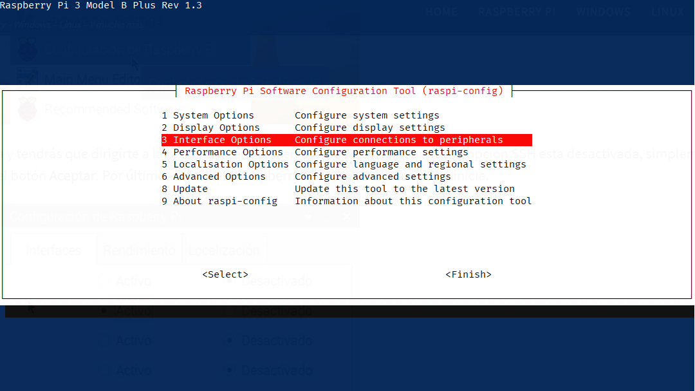
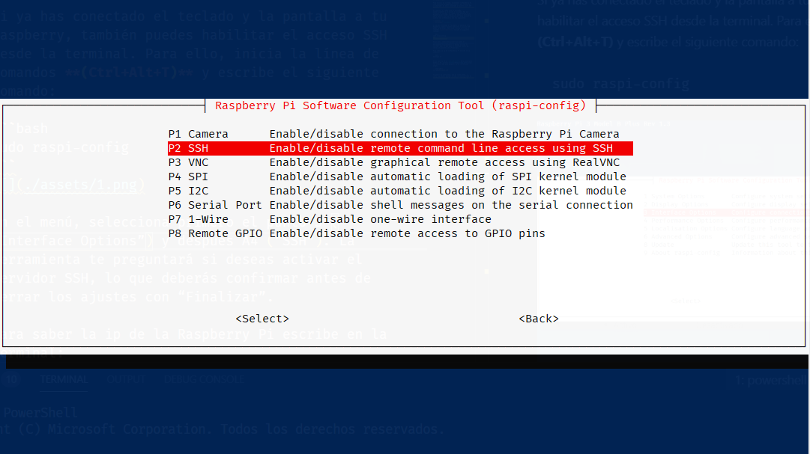
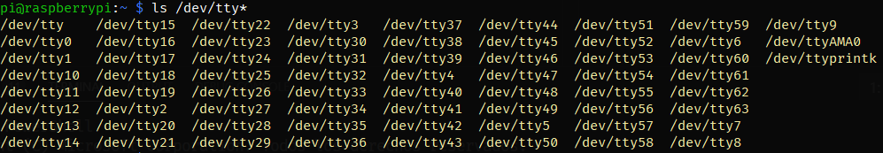

# Grabación de datos de sensores con Raspberry Pi 3B+

En este documento explico como conectar una Arduino a una Rasperry Pi por puerto serie para obtener los datos y grabarlos en la microSD.

## Índice

1. [Grabación de datos de sensores con Raspberry Pi 3B+](#grabación-de-datos-de-sensores-con-raspberry-pi-3b)
2. [Empezando desde 0 con la Raspberry Pi](#empezando-desde-0-con-la-raspberry-pi)
3. [Configurar SSH para usar la Raspberry Pi desde remoto (opcional)](#configurar-ssh-para-usar-la-raspberry-pi-desde-remoto-opcional)
4. [Acceder a los puertos serie](#acceder-a-los-puertos-serie)
5. [Preparar la Arduino](#preparar-la-arduino)
6. [Acceso a puerto serie desde Python (opcional)](#acceso-a-puerto-serie-desde-python-opcional)
7. [Acceso a puerto serie desde C++](#acceso-a-puerto-serie-desde-c)


## Empezando desde 0 con la Raspberry Pi

Para empezar hace falta instalar el SO en la RPi. Para grabar el SO en la microSD, se recomiendo usar el software proporcionado por los creadores, [Raspberry Pi Imager](https://www.raspberrypi.org/software/).

Para instalar el sistema:

1. Meter la microSD en el PC
2. Seleccionar el SO, se recomienda usar el Raspberry Pi OS (32-bits).
3. Seleccionar la microSD
4. Pulsar write

Para iniciar el sistema, encendemos la Raspberry Pi. Ésta necesita 5V/700mA para correr, por lo que con un adaptador de móvil conectado al puerto micro USB basta.

Al conectar el cable ésta se enciende automáticamente y se inicia el sistema. Hay que conectar un teclado, un ratón y una pantalla a la Raspberry para poder usarla, al menos al principio. Ahora contaré como no necesitarlos. Para iniciar el usuario las credenciales son las siguientes:

- usuario: `pi`
- contraseña: `raspberry`

## Configurar SSH para usar la Raspberry Pi desde remoto (opcional)

Si ya has conectado el teclado y la pantalla a tu Raspberry, también puedes habilitar el acceso SSH desde la terminal. Para ello, inicia la línea de comandos **(Ctrl+Alt+T)** y escribe el siguiente comando:

```bash
sudo raspi-config
```

Aparecerá un menú así:



En el menú, selecciona primero el punto `3 ("Interface Options")` y después `P2 ("SSH")`.



La herramienta te preguntará si deseas activar el servidor SSH, lo que deberás confirmar antes de cerrar los ajustes con "Finish".

Para conectarte desde otro PC saber la IP de la Raspberry Pi. Para verla, escribe en la terminal:

```bash
hostname –I
```

En mi caso la IP es `192.168.0.159`. Para conectarme desde mi PC, instalé [PuTTY](https://www.putty.org/) (un cliente SSH para Windows.) y en la terminal pongo:

```powershell
ssh pi@192.168.0.159
```

Te pedirá la contraseña, que es la de antes, y listo, ya puedes acceder a toda la funcionalidad de la RPi sin necesidad de pantallas y teclados.

## Acceder a los puertos serie

Para ver los puertos serie de la Raspberry Pi hace falta escribir el siguiente comando:

```bash
ls /dev/tty*
```

La salida será más o menos así:



Para encontrar la Arduino por USB a la Raspberry Pi, la conectas, y vuelves a ejecutar el comando para ver la lista y encontrar el nuevo elemento.

En mi caso (y seguramente en el tuyo) es `ACM0`.

## Preparar la Arduino

Para la prueba, se ha conectado un [joystick](https://aprendiendoarduino.wordpress.com/2018/10/16/joystick-arduino/) a los puertos analógicos A0 y A1 de la Arduino. El código es el siguiente:

```arduino
int vx;
int vy;
int mapX;
int mapY;

void setup()
{
    pinMode(A0, INPUT);
    pinMode(A1, INPUT);
    Serial.begin(9600);
}

void loop()
{
    vx = analogRead(A0);
    vy = analogRead(A1);

    vx = map(vx, 0, 1023, -512, 512);
    vy = map(vy, 0, 1023, -512, 512);

    Serial.print("X: ");
    Serial.print(vx);
    Serial.print(" | Y: ");
    Serial.print(vy);
    Serial.print("\n");

    delay(100);
}
```

También se puede encontrar en [sketch_joystick.ino](./sketch_joystick.ino) de este repositorio.

## Acceso a puerto serie desde Python (opcional)

Para probar si funciona todo bien, usaré Python para hacerlo rápido y no tener que usar C++.

Para ello, necesitaremos las librerías `python-serial` para la Raspberry Pi y `pyserial` para Python. Para instalarlas:

```bash
sudo apt-get install python-serial
sudo pip install pyserial
```

Para escribir el script desde la terminal, usaremos ´nano´.

```bash
nano serial_read.py
```

Se abrirá la ventana para editar y el código será el siguiente:

```python
import serial
# Inicio del puerto serie en dev/ttyACM0 a 9600 baudios
ser = serial.Serial('/dev/ttyACM0', 9600)

while True:
    read_serial=ser.readline()
    print(read_serial)
```

Para guardar el archivo, **Ctrl+S** y para salir,   **Ctrl+X**. Para ejecutarlo, hay que escribir:

```bash
python serial_read.py
```

También se puede encontrar en [serial_read.ino](./serial_read.py) de este repositorio.

## Acceso a puerto serie desde C++

Antes que nada, hace falta la librería [WiringPi](http://wiringpi.com/download-and-install/), aunque ésta viene con la Raspberry Pi, así que no nos tenemos que preocupar.

Para acceder al puerto serie desde C++, he escrito el siguiente script:

```cpp
#include <stdio.h>
#include <string.h>
#include <errno.h>

#include <wiringSerial.h>

int main ()
{
  int fd ;

  if((fd=serialOpen("/dev/ttyACM0",9600))<0){
    fprintf(stderr,"Unable to open serial device: %s\n",strerror(errno));
    return 1;
  }

  for (;;){
    putchar(serialGetchar(fd));
    fflush(stdout);
  }
}
```

También se puede encontrar en [serialRead.cpp](./serialRead.cpp) de este repositorio.

Para compilarlo:

```bash
g++ -Wall -o serialRead serialRead.cpp -lwiringPi  
```

Nótese que hace falta añadir `-lwiringPi` para añadir la librería, si no, no funciona.

Para correr el script:

```bash
.\serialRead
```

Si todo ha salido bien, debe aparecer algo así:

```bash
pi@raspberrypi:~/Desktop $ ./serialRead
X: 4 | Y: -3
X: 4 | Y: -2
X: 4 | Y: -12
X: 4 | Y: -23
X: 5 | Y: -26
X: 4 | Y: -23
X: 4 | Y: -18
X: 5 | Y: -12
```
